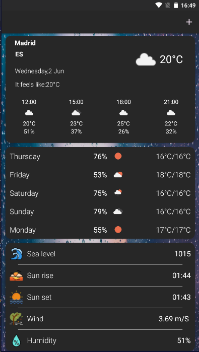
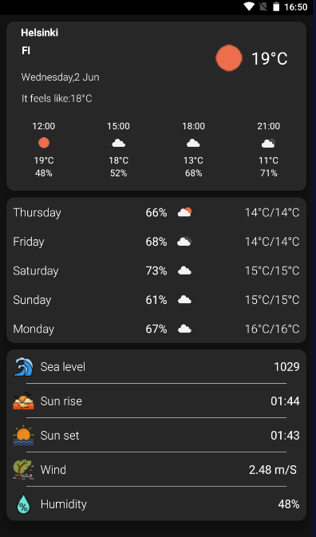
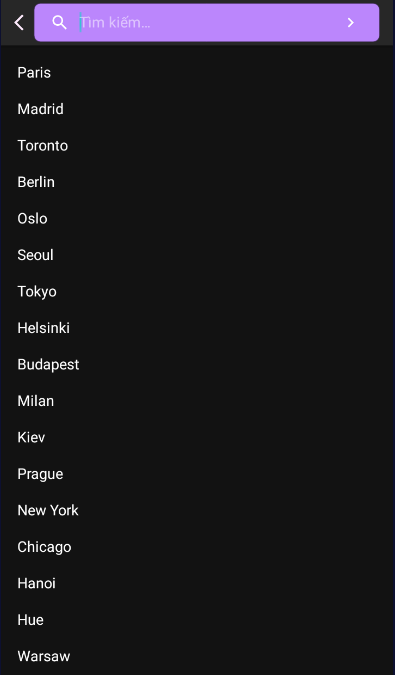

# WeatherLocation
project Advance
# Usage

# Built With
 - MVVM
 - Retrofit2
 - Gson
 - Picasso
 - Api(Open weather map)
 - Coroutine kotlin
 - Kotlin extension
 - ViewModel and LiveData
 
# Acknowledgments
  - Inspiration ToDoApp
  - MaterialDesignDemo by stormyhide

